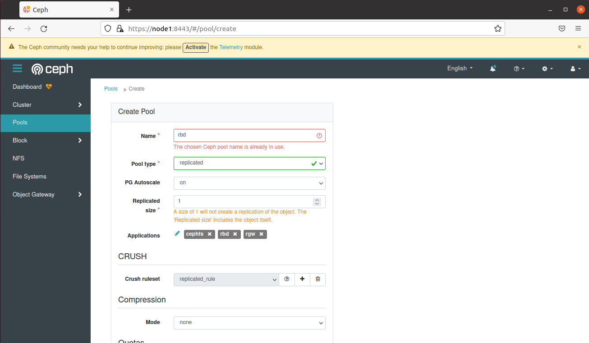

# Cài đặt Ceph all-in-one bằng Cephadm trên Ubuntu
---
## Mục Lục 
[I. Setup](#setup)
- [A. Yêu cầu](#req)
- [B. Cài đặt](#set)           

[II. Cài đặt Ceph cluster](#cc)

[III. Tài liệu tham khảo](#references)
---
 <a name='setup'></a> 
## I. Setup 
 <a name='req'></a> 
### A. Yêu cầu
- Máy thật sử dụng làm client, cài Ubuntu 22.04
- Máy ảo cài qua VirtualBox, sử dụng để thực thi Ceph all-in-one, cài Ubuntu 20.04
   - Máy ảo sử dụng 2 Network Adapter: Bridged Adapter nối đến máy thật và Host-Only Adapter


Cả máy ảo và máy thật đều yêu cầu có những phần mềm sau:
- Python 3
- Systemd
- Docker
- lvm2
- Cephadm

Trong đó Python3, Systemd và lvm2 đã có sẵn trên Ubuntu 20.04 và 22.04
 <a name='set'></a> 
### B. Cài đặt
- Install docker:
```
apt update
apt install -y ca-certificates curl gnupg lsb-release
curl -fsSL https://download.docker.com/linux/ubuntu/gpg | sudo gpg --dearmor -o /usr/share/keyrings/docker-archive-keyring.gpg
echo "deb [arch=$(dpkg --print-architecture) signed-by=/usr/share/keyrings/docker-archive-keyring.gpg] https://download.docker.com/linux/ubuntu $(lsb_release -cs) stable" | sudo tee /etc/apt/sources.list.d/docker.list > /dev/null
apt install -y docker-ce docker-ce-cli containerd.io docker-compose-plugin
```
- Install Cephadm:
  - Ubuntu 20.04:
```
curl --silent --remote-name --location https://github.com/ceph/ceph/raw/quincy/src/cephadm/cephadm
chmod +x cephadm
./cephadm add-repo --release quincy
./cephadm install
```
   - Ubuntu 22.04:

```
wget -q https://github.com/ceph/ceph/raw/quincy/src/cephadm/cephadm -P /usr/bin/
sudo chmod +x /usr/bin/cephadm
```
 <a name='cc'></a> 
## II. Cài đặt Ceph cluster
- Boostrap Ceph cluster:
```
cephadm prepare-host
cephadm bootstrap --mon-ip 192.168.56.103
```
>Bootstrap thành công

 

- Giao diện của Ceph dashboard:

 

- Chuyển file ceph.conf và ceph.client.admin.keyring. từ /etc/ceph của máy ảo sang /etc/ceph của máy thật

- Thêm storage vào Ceph:
```
ceph orch apply osd --all-available-devices
```
Với câu lệnh này Ceph có thể sử dụng bất kỳ devices nào khả dụng

- Tạo pool qua Ceph dashboard:

 

- Cấu hình pool vừa tạo:
```
ceph tell mon.\* injectargs '--mon_allow_pool_size_one=true'
ceph osd pool set rbd min_size 1
ceph osd pool set rbd pg_num_min 8
ceph osd pool set rbd pg_num 8
ceph osd pool set rbd size 1 --yes-i-really-mean-it
```

- Thông tin về pool:

 

Ceph cung cấp câu lệnh RBD để quản lý các block device images. Ta có thể tạo 1 image mới, resize, tạo snapshot và export block devices với lệnh rbd. 
 - Tạo 1 image mới 4gb tại client
```
rbd create disk01 --size 40960
```
> disk01 khả dụng trên rbd list:

 

- Kích hoạt rbd kernel module:
```
modprobe rbd
rbd feature disable disk01 exclusive-lock object-map fast-diff deep-flatten
```

- Map disk01 image đến 1 block device thông qua rbd kernel module
```
rbd map disk01
```
> disk01 được mapped đến /dev/rbd0 device

 

- Format disk01 với lệnh mkfs, ta sẽ sử dụng XFS file system: 
```
sudo mkfs.xfs /dev/rbd0
```

 

- Mount dev/rbd0 đến mnt directory
```
mkdir -p /mnt/mydisk
mount /dev/rbd0 /mnt/mydisk
```
- Ceph block device khả dụng trong disk filesystem của client:

 

> Trạng thái tại Ceph dashboard:

 

 

 <a name='references'></a> 
## III. Tài liệu tham khảo
- https://www.howtoforge.com/tutorial/using-ceph-as-block-device-on-centos-7/#step-configure-ceph-client-node
- https://kifarunix.com/install-and-setup-ceph-storage-cluster-on-ubuntu-2/
- https://docs.ceph.com/en/latest/cephadm/install/#bootstrap-a-new-cluster
- https://tracker.ceph.com/issues/46338
- http://lists.ceph.com/pipermail/ceph-users-ceph.com/2017-January/015760.html
- https://github.com/lamnguyen179/til/blob/main/Ceph/cephadm-install-cluster.md
