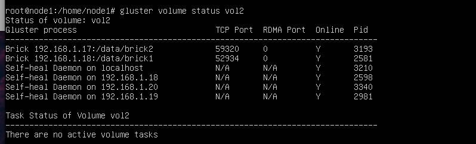
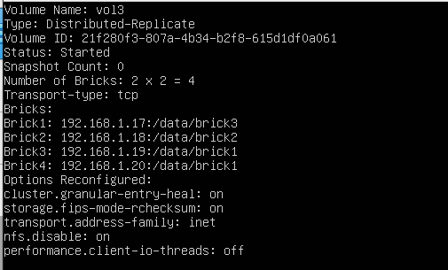
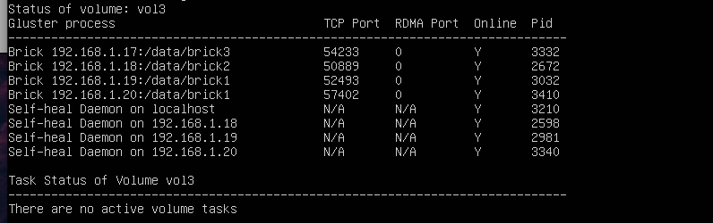
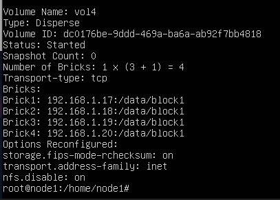
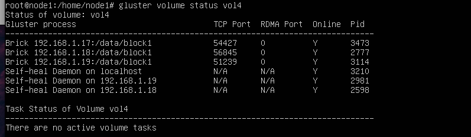

# Cài đặt Gluster-multi-node trên Ubuntu
---
## Mục Lục 

[I. Yêu cầu](#req)

[II. Cài đặt](#set)
- [1. Setup](#su)
- [2. Tạo volume distributed tại node1](#vd)
- [3. Tạo volume replicated tại node1](#vr)
- [4. Tạo volume distributed replicated tại node1](#vdr)    
- [5. Tạo volume dispersed tại node1](#vdi)
- [6. Cài đặt GlusterFS cho client](#cli)

[III. Tài liệu tham khảo](#references)
---
 <a name='req'></a> 
### I. Yêu cầu
- Máy thật chạy Ubuntu 22.04
- Máy ảo cài Ubuntu Server 22.04
   - Chọn Bridged Adapter nối đến máy thật trong network interfaces
- Mô hình mô phỏng như sau:
  - 4 máy ảo đóng vai trò là server:
     - Node 1: 192.168.1.17
     - Node 2: 192.168.1.18
     - Node 3: 192.168.1.19
     - Node 4: 192.168.1.20
  - Máy thật đóng vai trò làm client, IP 192.168.1.14


 <a name='set'></a> 
### II. Cài đặt
 <a name='su'></a> 
#### 1. Setup
- Format phân vùng sdb:
```
mkfs.xfs /dev/sdb
```
- Tạo thư mục data để mount phân vùng:
```
mkdir -p /data
mount /dev/sdb /data
```
- Khai báo vào file cấu hình /etc/fstab để khi restart server, hệ thống sẽ tự động mount vào thư mục:
```
echo '/dev/sdb /data xfs defaults 1 2' >> /etc/fstab
```
  - Cài đặt GlusterFS cho server:
```
# apt-get install glusterfs-server
```
 - Khởi động trình quản lý gluster:
 ```
service glusterd start
 ```
**Các bước trên làm tương tự với tất cả các host**

- Thêm các node vào pool (tại node 1):
```
gluster peer probe 192.168.1.18
gluster peer probe 192.168.1.19
gluster peer probe 192.168.1.20
```

 <a name='vd'></a> 
#### 2. Tạo volume distributed tại node1:
```
mkdir -p /data/block1
gluster volume create vol1 transport tcp 192.168.1.17:/data/block1
```
 - Khởi động volume:
 ```
gluster volume start testvol
```

> Thông tin về volume:

  

> Volume status:

  

 <a name='vr'></a> 
#### 2. Tạo volume replicated tại node1:
```
mkdir -p /data/block2 tại node 1
mkdir -p /data/block1 tại node 2
gluster volume create vol2 rep 2 transport tcp 192.168.1.17:/data/block2 192.168.1.18:/data/block1
```
- Khởi động volume:
 ```
gluster volume start testvol
```

> Thông tin về volume:

  

> Volume status:

  

<a name='vdr'></a>
#### 3. Tạo volume distributed replicated trên 4 node:
```
mkdir -p /data/block3 tại node 1
mkdir -p /data/block2 tại node 2
mkdir -p /data/block1 tại node 3
mkdir -p /data/block1 tại node 4
gluster volume create vol3 replica 2 transport tcp tcp 192.168.1.17:/data/block3 192.168.1.18:/data/block2 192.168.1.19:/data/block1 192.168.1.20:/data/block1
```
- Khởi động volume:
 ```
gluster volume start testvol
```

> Thông tin về volume:

  

> Volume status:

  
<a name='vdi'></a>
#### 4. Tạo volume dispersed trên 4 node:
```
mkdir -p /data/block4 tại node 1
mkdir -p /data/block3 tại node 2
mkdir -p /data/block2 tại node 3
mkdir -p /data/block2 tại node 4
gluster volume create vol4 disperse-data 3 redundancy 1 transport tcp tcp 192.168.1.17:/data/brick4 192.168.1.18:/data/brick3 192.168.1.19:/data/brick2 192.168.1.20:/data/brick2
```
- Khởi động volume:
 ```
gluster volume start testvol
```

> Thông tin về volume:

  

> Volume status:

  

<a name='cl'></a>
 #### 6. Cài đặt GlusterFS cho client:
 ```
apt-get install glusterfs-client
 ```
 - Mount volume để sử dụng từ phía client:
 
 ```
mkdir -p /data/block1
mkdir -p /data/block2
mkdir -p /data/block3
mount -t glusterfs 192.168.1.17:/vol1 /mnt
mount -t glusterfs 192.168.1.17:/vol2 /mnt
mount -t glusterfs 192.168.1.17:/vol3 /mnt

 ```


 <a name='references'></a> 
### III. Tài liệu tham khảo
- https://123host.vn/community/tutorial/huong-dan-cai-dat-glusterfs-tren-ubuntu-20-04.html
- https://docs.gluster.org/en/latest/Quick-Start-Guide/Quickstart/
- https://github.com/hocchudong/ghichep-glusterFS
- https://access.redhat.com/documentation/en-us/red_hat_gluster_storage/3.4/html/administration_guide/chap-red_hat_storage_volumes-creating_dispersed_volumes_1
