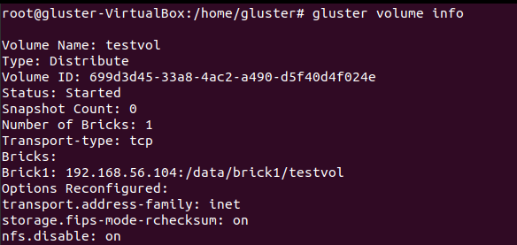

# Cài đặt Gluster 1 node trên Ubuntu
---
## Mục Lục 
[I. Cài đặt](#set)

[II. Tài liệu tham khảo](#references)
---
 <a name='set'></a> 
### I. Cài đặt
- Format phân vùng sdb:
```
mkfs.xfs /dev/sdb
```
- Tạo thư mục mnt/brick1 để mount phân vùng:
```
mkdir -p /data/brick1
mount /dev/sdb /data/brick1
```
- Khai báo vào file cấu hình /etc/fstab để khi restart server, hệ thống sẽ tự động mount vào thư mục:
```
echo '/dev/sdb /data/brick1 xfs defaults 1 2' >> /etc/fstab
```
  - Cài đặt GlusterFS cho server:
```
# apt-get install glusterfs-server
```
 - Khởi động trình quản lý gluster:
 ```
service glusterd start
 ```
 - Tạo volume:
```
mkdir -p /data/brick1/testvol
gluster volume create testvol transport tcp 192.168.56.104:/data/brick1/testvol
```
 - Khởi động volume:
 ```
gluster volume start testvol
```
>Khởi động thành công:

  


> Thông tin về volume:

  

> Gluster status:

  

 - Cài đặt GlusterFS cho client:
 ```
apt-get install glusterfs-client
 ```
 - Mount volume để sử dụng từ phía client:
 ```
mkdir /mnt/brick1
mount -t glusterfs 192.168.56.104:/testvol /mnt/brick1
 ```
 > Cấp thành công storage cho client:

  

 <a name='references'></a> 
## III. Tài liệu tham khảo
- https://123host.vn/community/tutorial/huong-dan-cai-dat-glusterfs-tren-ubuntu-20-04.html
- https://docs.gluster.org/en/latest/Quick-Start-Guide/Quickstart/
- https://github.com/hocchudong/ghichep-glusterFS
