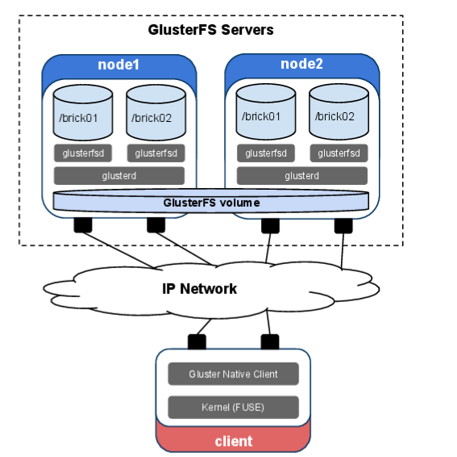
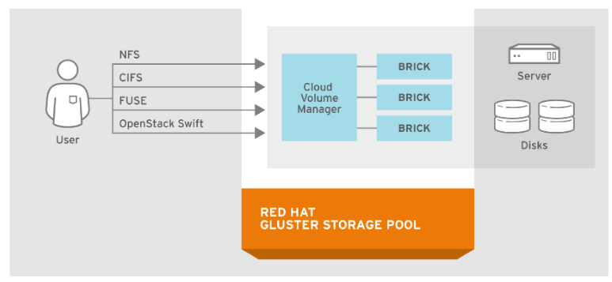
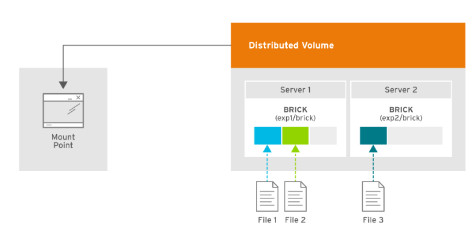
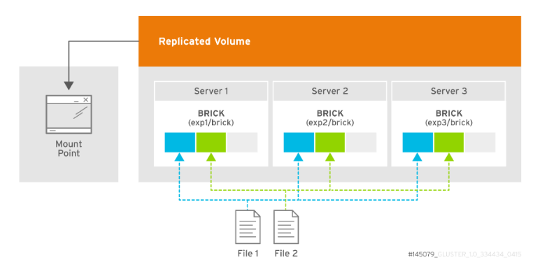
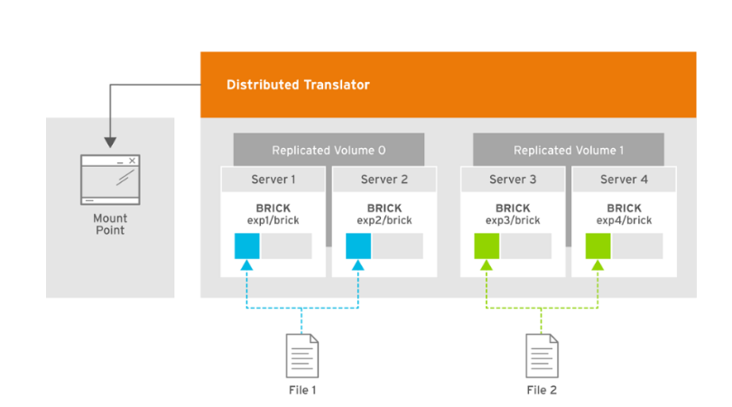
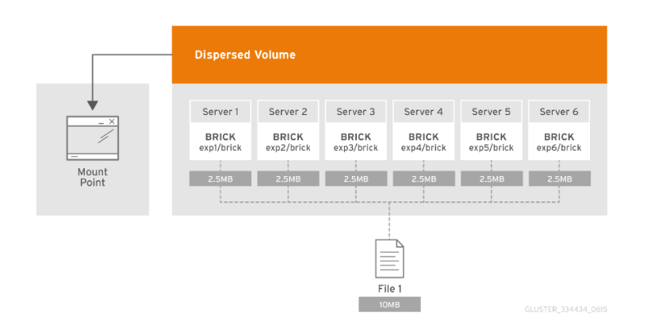

**Gluster Architecture**
---
## Mục Lục 
[1. Giới thiệu về GlusterFS](#intro)

[2. Các loại volumes cơ bản](#vol)

[3.Một số đặc điểm nổi bật khi triển khai GlusterFS](#feature)

[4. Tài liệu tham khảo](#references)
---
  
## **1. Giới thiệu về GlusterFS**

GlusterFS là một hệ thống tập tin phân tán (Distributed file system) open source, có khả năng mở rộng được phát triển bởi Gluster Inc. Sau đó Gluster Inc được Red Hat mua lại và GlusterFS (cùng với RHEL - Red Hat Enterprise Linux) được sử dụng làm nền tảng chính cho Red Hat Gluster Storage, 1 giải pháp SDS của Red Hat.

- Kiến trúc GlusterFS:

  

Biểu đổ trên cho ta thấy 1 kiến trúc đơn giản của 1 GlusterFS gồm 2 node. GlusterFS sẽ tích hợp các tài nguyên lưu trữ từ nhiều server về 1 global namespace (Global namespace là chức năng chính của 1 hệ thống lưu trữ phân tán giúp cung cấp 1 mặt phẳng điều khiển và quản lý tập trung để tìm kiếm và truy cập đến các dữ liệu được lưu trữ phân tán trên hệ thống).

Trong một hệ thống GlusterFS, các server dùng để lưu trữ được gọi là các node, các node này kết hợp lại với nhau thành một không gian lưu trữ lớn được gọi là Gluster Storage Pool. Như trên hình là một mô hình kết nối giữa 2 node thành một Storage Pool.

Mỗi node trong pool có thể exports 1 hoặc nhiều bricks thông qua glusterfsd daemon - daemon quản lý tiến trình của brick (các glusterd daemon – daemon quản lý chung duy nhất trên mỗi server sẽ quản lý các glusterfsd daemon này). Bricks là các local filesystems, và có thể được tạo ra từ các phân vùng lưu trữ mới trên mỗi node. Brick sẽ được định nghĩa bởi 1 server (name or IP) và 1 đường dẫn. (Vd: 192.168.1.17:/data/brick1) và dung lượng của các brick sẽ bị giới hạn bởi filesystem. Số lượng bricks mỗi node là không giới hạn

Mỗi volume là một tập hợp logic của các bricks. Các volume sẽ được tạo ra trên pool để client có thể mount đến và sử dụng. Có nhiều cách để truy cập vào gluster volumes trong đó cách được khuyên dùng là sử dụng Gluster native client. Cách này sẽ đem lại hiệu năng tốt nhất và cũng đơn giản nhất do nó dựa trên FUSE (Interface cho phép người dùng tạo các filesystem các máy tính mà không phải chỉnh sửa kernel, FUSE được tích hợp trong kernel của Linux). Ngoài ra, còn có thể truy cập đến volume của Gluster thông qua OpenStack Swift API và các giao thức như NFS và CIFS.

  

  
### 2. Các loại volumes cơ bản:

- Distributed Volume:

     - Dữ liệu được lưu trữ phân tán trên từng bricks trong volume.
     - Ta có thể sử dụng distributed volume nếu ưu tiên mở rộng dung lượng lưu trữ (dung lượng lưu trữ bằng tổng dung lượng các brick) và không cần các brick dự phòng để khắc phục lỗi.
     - Nếu 1 trong các brick bị lỗi thì dữ liệu trên brick đó sẽ mất

  

- Replicated Volume:

    - Dữ liệu được nhân bản đến những brick còn lại trong volume và đồng bộ tất cả các cập nhật mới.
    - Nó sẽ cung cấp tính sẵn sàng (high availability) và độ tin cậy cao cho dữ liệu.
    - Số lượng nhân bản là không giới hạn
    - Lãng phí tài nguyên hệ thống

  

- Distributed Replicated: Kết hợp distributed và replicated volume

  

    - Hệ thống sẽ yêu cầu cần tối thiểu 3 node
    - Dữ liệu được phân tán vào các replicated bricks trong volume
    - Số bricks phải là bội của số replica. Các bricks kề nhau sẽ là replica của nhau. Ví dụ có 8 bricks và số replica là 2 thì 2 bricks đầu sẽ là replica của nhau và tương tự đến hết.
    - Vừa đảm bảo mở rộng được dung lượng lưu trữ, vừa đảm báo tính sẵn sàng cho hệ thống.

- Disperse:

    - Disperse volume dựa trên erasure coding (EC). EC là 1 cơ chế bảo vệ dữ liệu trong đó dữ liệu được phân mảnh và mã hóa với các dữ liệu dự phòng (redundancy data) và lưu trữ phân tán trên các bricks của volume. Điều này cho phép dữ liệu khôi phục được lưu trữ trên 1 hay nhiều brick trong trường hợp các bricks bị lỗi.
    - Dispersed volume yêu cầu ít không gian lưu trữ hơn khi so sánh với replicated volume. Ví dụ để trữ 1TB dữ liệu thì replicated volume sẽ yêu cầu 2TB bộ nhớ trong khi với dispersed volume là 1.5 TB (với redundancy level 2)
    - Khả năng chịu lỗi của dispersed volume sẽ phụ thuộc vào redundancy level

  

- Việc bảo toàn dữ liệu cung qua EC có thể được biểu diễn dưới công thức: n = k + m. Với n là tổng số lượng các bricks, k là số bricks chứa các dữ liệu và m là số bricks mà hệ thống có thể chịu lỗi (đồng thời là các parity bricks giúp khôi phục dữ liệu khi có sự cố)
- Các cấu hình được hỗ trợ:
    - 6 bricks với redundancy level 2 (4 + 2)
    - 10 bricks với redundancy level 2 (8 + 2)
    - 11 bricks với redundancy level 3 (8 + 3)
    - 12 bricks với redundancy level 4 (8 + 4)
    - 20 bricks với redundancy level 4 (16 + 4)
    - Khi cần ghi dữ liệu, client sẽ tính toán dữ liệu và tạo ra các parity data. Khi bricks bị lỗi, parity data ta sẽ được sử dụng để khôi phục lại dữ liệu

 
### 3.Một số đặc điểm nổi bật khi triển khai GlusterFS:

- Không có Metadata server: Khác với Ceph và nhiều distributed filesystems khác, GlusterFS không sử dụng Metadata server. Trong 1 kiến trúc filesystem với 1 metadata server, data sẽ được lưu trữ phân tán trên các nodes và sẽ có 1 server theo dõi vị trí của các metadata và điều khiển truy cập đến storage nodes. Khi người dùng có yêu cầu I/O đến 1 file, nó sẽ gửi yêu cầu dến metadata server, và server sẽ bảo với client phải truy hồi data ở đâu. Với Gluster thì nó sẽ tìm ra đúng node mà file được lưu trữ bằng thông qua thuật toán hashing (băm). Việc bỏ đi metadata server là 1 ưu điểm lớn khi nó tránh được tình trạng "thắt cổ chai" khi truy xuất dữ liệu qua Metadata server và không truy xuất đến dữ liệu được nếu metadata server bị lỗi
- Cài đặt và thực thi đơn giản ở cả phía client và server
- Việc xóa volume và thay đổi nodes trong cluster còn phức tạp
- Geo-replication: Sao chép dữ liệu giữa những hệ thống lưu trữ nằm ở vị trí khác nhau.

 
### 4.Tài liệu tham khảo:
[Scale Out with GlusterFS (acm.org)](https://dl.acm.org/doi/fullHtml/10.5555/2555789.2555790)

[Oracle® Linux Gluster Storage for Oracle Linux User's Guide - Chapter 1 Introduction to Gluster Storage for Oracle Linux](https://docs.oracle.com/en/operating-systems/oracle-linux/gluster-storage/gluster-intro.html#gluster-about)

[What is Global Namespace | Manage Your Unstructured Data (datacore.com)](https://www.datacore.com/blog/what-is-global-namespace-file-object-storage/)

[Oracle® Linux Gluster Storage for Oracle Linux User's Guide - Chapter 1 Introduction to Gluster Storage for Oracle Linux](https://docs.oracle.com/en/operating-systems/oracle-linux/gluster-storage/gluster-intro.html#gluster-about)

[Architecture - Gluster Docs](https://docs.gluster.org/en/main/Quick-Start-Guide/Architecture/#types-of-volumes)

[hocchudong/ghichep-glusterFS (github.com)](https://github.com/hocchudong/ghichep-glusterFS)

[6.7. Creating Distributed Replicated Volumes Red Hat Gluster Storage 3.1 | Red Hat Customer Portal](https://access.redhat.com/documentation/en-us/red_hat_gluster_storage/3.1/html/administration_guide/sect-creating_distributed_replicated_volumes)

[PowerPoint Presentation (snia.org)](https://www.snia.org/sites/default/files/VijayBellur_SoftwareDefined_Storage_Gluster.pdf)

[GlusterFS file system elastic hash algorithm - Birost](https://blog.birost.com/a?ID=00600-9c488a3c-3e92-4fa8-99d3-871e97a34f58)
