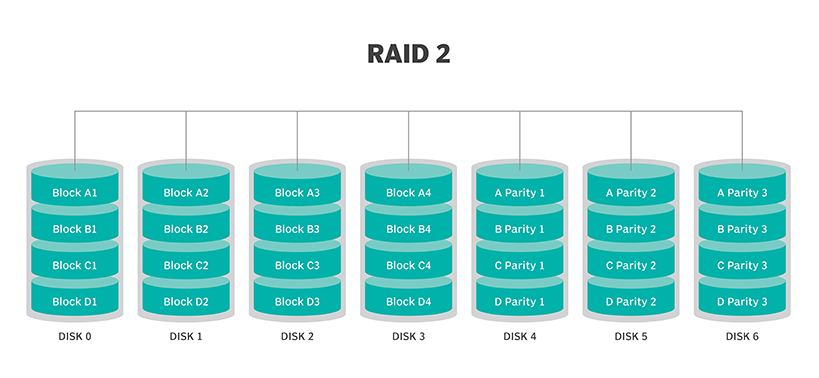
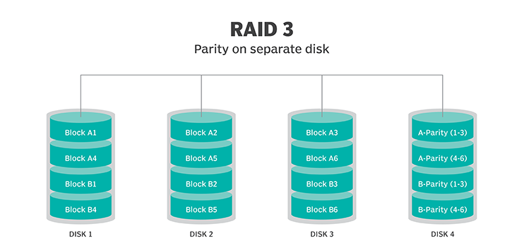
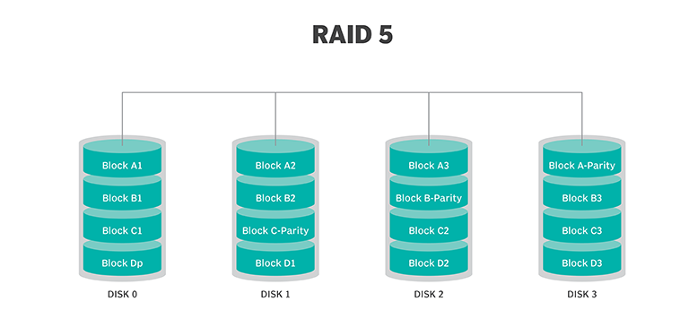
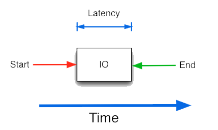

# Tuần 1: Tìm hiểu sơ bộ về Storage
---
## **MỤC LỤC:**

### I. RAID

### II. Các Performance Metrics cơ bản

### III. Khái niệm về Software Defined Storage

### IV. Tài liệu tham khảo
---
### I. Khái niệm về RAID
#### 1. Khái niệm về RAID
**RAID** (Redundant Array of Independent Disks) là 1 công nghệ ảo hóa lưu trữ dữ liệu theo hình thức gộp nhiều ổ đĩa vật lý thành 1 hệ thống chung thay vì sử dụng tách rời từng ổ đĩa đơn. Việc này sẽ giúp tăng hiệu năng (khả năng truy xuất dữ liệu, tốc độ đọc ghi…) và độ an toàn dữ liệu
- Thuật ngữ **RAID** được đặt ra vào năm 1987 bởi nhóm nghiên cứu tại Đại học California. Chữ I trong **RAID** ban đầu là đại diện cho “Inexpensive” bởi vì họ tìm cách gộp các ổ đĩa HDD rẻ tiền trên thị trường. Tuy nhiên ngày nay các ổ đĩa như vậy đã không còn trên thị trường nên chữ “I” trong **RAID** đại diện cho “Independent”
- RAID sẽ hoạt động bằng cách cho phép dữ liệu truy cập vào nhiều ổ đĩa. Các ổ đĩa tập hợp này sẽ được hệ điều hành hiểu như 1 một ổ lưu trữ đơn
- Việc thực thi **RAID** có thể được hoàn thành bằng cách sử dụng 1 controller đặc biệt (hardware RAID) hoặc bởi 1 driver hệ điều hành (software RAID)
     - `Hardware RAID`: Các ổ đĩa được kết nối vào 1 controller thường nằm ở RAID card hoặc được tạo trên 1 bo mạch. Controller sẽ xử lý trực tiếp các ổ đĩa và tất cả quá trình xử lý sẽ được hoàn thành trên nó vì thế nên RAID Controller quản lý cấu hình RAID hoàn toàn độc lập với hệ điều hành
     - `Software RAID`: Khi ổ lưu trữ được kết nối đến PC hay server mà không có RAID controller, cấu hình **RAID** sẽ được quản lý bởi 1 phần mềm trong HĐH

#### 2. RAID Levels
Có rất nhiều cách để thực hiện 1 tổ hợp **RAID**, bằng cách sử dụng kết hợp các phương pháp lưu trữ như `Phân chia dải (striping)`, `Tạo bản sao (Mirroring)` và `Parity (chẵn lẻ)`. Việc sử dụng và kết hợp các kỹ thuật này vào hệ thống RAID được gọi là RAID levels. Mỗi level sẽ có một hiệu năng, độ tin cậy và giá cả khác nhau. Mỗi level cũng có 1 thuật toán khác biệt để thực hiện khả năng chịu lỗi
- **RAID 0**: Thực hiện `block striping` (phân chia dải theo khối), tức là chia luồng dữ liệu thành các khối logic và phân chia tuần tự vào các ổ đĩa. Khác với các RAID khác, **RAID 0** không có khả năng chịu lỗi, nếu 1 ổ đĩa hỏng thì dữ liệu sẽ bị mất. Tuy vậy, **RAID 0** cung cấp hiệu năng cao nhất. Nó nhanh bởi vì dữ liệu có thể được chuyển đồng thời từ tất cả các ổ đĩa và việc đọc ghi giữa các ổ đĩa cũng có thể được thực hiện đồng thời. 
    - Tổng dung lượng ổ đĩa sẽ tương ứng với tổng dung lượng của từng ổ đĩa được gộp lại. **RAID 0** yêu cầu phải có ít nhất 2 ổ cứng.
 
 

- **RAID 1**: Thực hiện `disk mirrorin`g (tạo bản sao ổ đĩa), khi 1 bản sao của dữ liệu sẽ được lưu vào cả 2 ổ vì thế nên **RAID 1** có khả năng sửa lỗi của 1 ổ đĩa. Việc để 2 bản của dữ liệu ở 2 ổ khác nhau giúp bảo vệ dữ liệu nếu đĩa bị hỏng. 
     - **RAID 1** chỉ hỗ trợ việc gộp 2 ổ tương đương và tổng dung lượng có thể sử dụng sẽ tương ứng với dung lượng của 1 ổ
 
  
  
  
- **RAID 2**: Dữ liệu được phân bố tuần tự ra nhiều ổ đĩa theo cấp độ bit hoặc bytes. Một vài ổ đĩa sẽ được sử dụng để dự phòng và chứa các bit dự phòng sử dụng Mã sửa lỗi (Error correcting code - ECC). Ngay khi có những hoạt động phân bố dữ liệu thì các mã này sẽ được tính toán cũng như ghi cùng dữ liệu lưu vào trong ổ đĩa ECC riêng biệt. Nếu như hoạt động đọc dữ liệu xuất hiện, các mã ECC sẽ được đọc nhằm xác nhận không có bất cứ lỗi nào xảy ra từ khi ghi dữ liệu.
     - Nếu như 1 lỗi đơn xảy ra thì nó ngay lập tức sẽ được sửa. **RAID 2** có khả năng chịu lỗi của 1 ổ đĩa. 
     - **RAID 2** hiện tại không còn được sử dụng do chi phí và yêu cầu cao nhưng hiệu suất lại không cao (do phân tán dữ liệu ở cấp độ bit). 
     - Tổng dung lượng khả dụng = [(Tổng số ổ đĩa gộp lại trừ cho tổng số ổ được dành ra để dự phòng) x (Dung lượng của một ổ cứng)].
 
 

- **RAID 1+0**: Sự kết hợp của `RAID 0` và `RAID 1`. Áp dụng cả `striping` và `disk mirroring` nên phương pháp này đảm bảo cả hiệu năng và khả năng sửa lỗi. Vì đây không phải là RAID level theo chuẩn nên nó sẽ không xuất hiện trong lựa chọn level được hỗ trợ bởi controller. Nếu 4 hoặc nhiều ổ đĩa hơn (theo số chẵn) được chọn cho `RAID 1` thì **RAID 1+0** sẽ được tự động áp dụng. 
     - Tổng dung lượng khả dụng = [(tổng số ổ cứng gộp lại chia đôi) x  (Dung lượng của một ổ cứng)]. **RAID 1+0** yêu cầu phải có ít nhất 4 ổ cứng.
 
 

- **RAID 3**: Dữ liệu được phân tán tuần tự qua các ổ đĩa ở cấp độ bit hoặc byte , 1 ổ sẽ được dành riêng cho parity (chẵn lẻ). Trong kỹ thuật chẵn lẻ thì 1 hàm chẵn lẻ nhất định sẽ được tính cho những khối dữ liệu. Nếu như 1 ổ đĩa bị lỗi, thì khối bị thiếu sẽ được tính lại từ tổng kiểm tra và cung cấp về khả năng chịu lỗi RAID. Tuy nhiên, ổ đĩa parity trong RAID lại khiến hiệu suất không cao, đặc biệt trong hoạt động ghi ngẫu nhiên, bởi vì nó phải được truy cập liên tục khi có dữ liệu được ghi. 
     - **RAID 3** yêu cầu phải có ít nhất 3 ổ cứng.
     - Tổng dung lượng khả dụng sẽ = [(Tổng số ổ cứng - 1 (ổ dành cho parity)) x (Dung lượng của một ổ cứng)]
 
 

- **RAID 4**: Tương tự như `RAID 3` nhưng dữ liệu được phân tán tuần tự theo các khối thay vì các byte. **RAID 4** yêu cầu phải có ít nhất 3 ổ cứng.

- **RAID 5**: Dữ liệu và các Parity sẽ được phân tán tuần tự qua các ổ đĩa. Dữ liệu và parity dự phòng tương ứng của nó không bao giờ cùng nằm trên 1 ổ đĩa. Khi 1 ổ đĩa bị hỏng, dữ liệu gốc của nó có thể khôi phục bằng cách sử dụng Parity nằm ở ổ đĩa khác. **RAID 5** sẽ cho phép có 1 ổ cứng tối đa bị chết ở 1 thời điểm, nếu như có nhiều hơn một ổ cứng ở một thời điểm bị chết thì tất cả dữ liệu sẽ mất hết.
    - **RAID 5** vừa cung cấp được cơ chế chịu lỗi vừa đảm bảo hiệu suất hơn so với RAID 3 hay RAID 4 nên nó là công nghệ RAID được sử dụng phổ biến nhất hiện nay. 
    - Tổng dung lượng khả dụng sẽ = [(Tổng số ổ cứng - 1 (ổ dành cho parity)) x (Dung lượng của một ổ cứng)]. **RAID 5** yêu cầu phải có ít nhất 3 ổ cứng.

 
 
 
- **RAID 6**: Tương tự như `RAID 5` nhưng có thêm 1 parity được phân tán qua các ổ đĩa để đảm bảo hệ thống có thể hoạt động kể cả khi 2 ổ cứng bị hỏng. **RAID 6** yêu cầu phải có ít nhất 4 ổ cứng.

### II. Các Performance Metrics cơ bản

#### 1. IOPS 
**IOPS** - Input/Output operation per second: Đơn vị đo tiêu chuẩn được sử dụng cho các thiết bị lưu trữ để đo số lượng tác vụ đọc ghi được hoàn thành trong 1 giây. Thông số **IOPS** càng cao thì tốc độ xử lý càng nhanh, tác vụ xử lý càng nhiều giúp tăng hiệu năng thiết bị.
- Một số công thức liên quan đến IOPS
    - Tổng IOPS = IOPS per Disk * Số ổ cứng

    - IOPS thực = (Tổng IOPS * Write%)/(Raid Penalty) + (Tổng IOPS * Read %) (Raid Penalty: Số lượng ổ cứng tối thiểu ứng với mỗi RAID level)

    - Số ổ cứng = ((Read IOPS) + (Write IOPS*Raid Penalty))/ IOPS per Disk

#### 2. Throughput
**Throughput** (Thông lượng): Tốc độ truyền dữ liệu (mb/s). Nếu IOPS đo số lượng tác vụ đọc ghi được hoàn thành trong 1 giây thì Throughput đo số bits được đọc hoặc viết mỗi giây
   - Throughput = IOPS * IO Average size
   
#### 3. Latency
**Latency** là tổng thời gian hoàn thành từ khi 1 yêu cầu được nhận cho đến khi người yêu cầu nhận được phản hồi từ hệ thống

 

#### 4. IO size
**IO size**: Kích thước của 1 hoạt động I/O, có thể được coi là payload (kích thước phần dữ liệu thực sự được truyền đi 2 phía). Kích thước I/O được tính theo kb và thường nằm trong khoảng từ 512 bytes đến 256 KB, hoặc có thể lên đến 1 MB.

#### 5. Block size
**Block size**: 1 block là khái niệm trừu tượng của nhiều khối dữ liệu vật lý. File hệ thống thường viết dữ liệu theo blocks dữ liệu thay vì bits hay bytes đơn. 
VD: SQL server logs sử dụng khối các block 64 kb, Windows server sử dụng các block 4kb
Trong IBM Spectrum, 1 block là số dung lượng lớn nhất có thể được cấp cho 1 file và nó cũng là lượng dữ liệu lớn nhất có thể truy cập ở 1 hoạt động I/O đơn. 

> Sử dụng tool benchmark iostat để kiểm tra các thông tin thống kê về CPU và I/O
 
 - %iowait: phần trăm thời gian mà CPU(s) rảnh  khi hệ thống thực hiện disk I/O request.
 - %idle: phần trăm thời gian mà CPU(s) rảnh và hệ thống không thực hiện disk I/O request.
- %steal: xem thêm ở man 1 iostat.
Phần the Device Utilization report cũng gồm 7 giá trị (tên cột / số cột hay đơn vị có thể khác nếu sử dụng các option của iostat, ở đây chỉ viết về ví dụ nói trên)
- Device: tên device, ở đây là "sda". Một device có 1 hay nhiều partition. (dùng iostat -pd sda để hiển thị thông số cho từng partition trong sda)
tps: transfer per second. Mỗi  transfer là một I/O request đến device. Nhiều logical request có thể được hợp lại thành 1 I/O request đến device =>  một transfer không có kích thước cố định.
- kB_read/s: số kilobytes đọc từ device
- kB_read: tổng số kilobytes đọc từ device  = kB_read/s * interval (s)
- kB_wrtn/s: số kilobytes ghi vào device
- kB_wrtn: tổng số kilobytes ghi  từ device  = kB_read/s * interval (s)

### III. Khái niệm về Software Define Storage
**Software Defined Storage (SDS)** là kiến trúc lưu trữ mà phân tách phần mềm lưu trữ (thực hiện chức năng cung cấp dung lượng, bảo vệ dữ liệu và điều khiển sắp xếp dữ liệu) với phần cứng của nó. 
Việc tách phần mềm ra khỏi phần cứng cho phép SDS có thể dễ dàng thay đổi, nâng cấp và mở rộng phần cứng mà không ảnh hướng đến tài nguyên phần mềm. Khác với các hệ thống lưu trữ cũ như NAS hay SAN, SDN được thiết kế để có thể thực hiện với mọi tiêu chuẩn công nghiệp hoặc hệ thống x86, bỏ đi sự phụ thuộc của phần mềm vào phần cứng độc quyền với mức giá phải chăng.
SDS còn có khả năng quản lý tập trung các storage trong khi vẫn đảm bảo được các đặc điểm và tính năng đa dạng cho nó. Nói cách khác SDS như 1 controller phần mềm giúp ảo hóa và quản lý bộ lưu trữ vật lý của bạn

 

