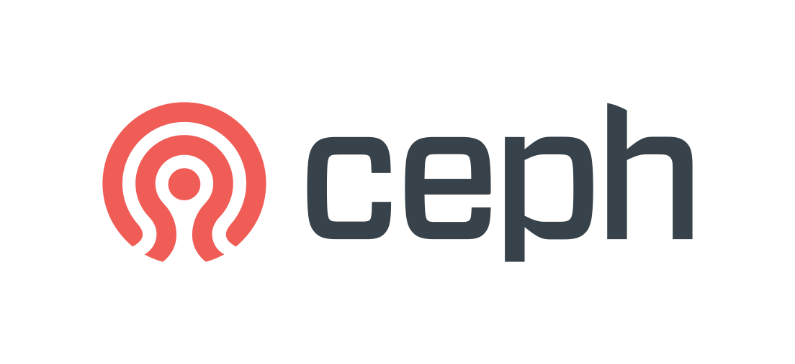

# Week 1: Storage Services
---
## **Mục Lục**

### I. Phân biệt File, Block và Object storage
- #### 1. File storage là gì ?
- #### 2. Block storage là gì ?
- #### 3. Object storage là gì ?

### II. Giải pháp của các vendors để đáp ứng 3 dịch vụ trên 

### III. Ceph - Giải pháp SDS đáp ứng 3 dịch vụ trên
### IV. Tài liệu tham khảo

---
### I. Phân biệt File, Block và Object storage
**File**, **blocks** và **objects** là những formats lưu trữ chứa, sắp xếp và thể hiện dữ liệu theo những cách khác nhau, với những chức năng và giới hạn tiêng. File storage sắp xếp và thể hiện dữ liệu theo cấp bạc (hierachy) của files trong các folders. Block storage sẽ chia dữ liệu theo các khối và object storage sẽ quản lý dữ liệu và liên kết nó với metadata tương ứng
Với **File Storage** có thể được di chuyển nội bộ và hoạt động tốt nhất 
#### 1. File storage là gì ?
**File Storage**: Cơ chế lưu trữ phân cấp được sử dụng để tổ chức và lưu trữ dữ liệu trên ổ cứng máy tính hoặc trên thiết bị NAS. Trong file storage, dữ liệu sẽ được lưu trữ trong files, files được sắp xếp trong các folders, còn các folders được sắp xếp dưới 1 phân cấp các directories và subdirectories
Khi cần truy cập vào dữ liệu, thì máy tính sẽ cần biết đường dẫn đến dữ liệu đó. Khi 1 file được lưu trữ theo cách này, sẽ có những metadata được gán theo nó như creation date, modification date và file size.
Files có thể được lưu trữ trong các thiết bị NAS, hệ thống lưu trữ nền cloud, network drives, computer hard drives và flash drives

- **Ưu điểm**:
   - Dễ dàng truy cập với các folder quy mô nhỏ
   - Quen thuộc với đa số người dùng
   - Users có thể tự quản lý file dễ dàng
   - File sharing: File sharing rất lý tưởng cho việc tập trung hóa và chia sẻ files trong 1 mạng LAN. File lưu trữ trên 1 thiết bị NAS rất dễ truy cập bởi bất kỳ máy tính nào trong mạng được cấp quyền
   - Cho phép cấp quyền truy cập, đọc, viết hoặc khóa ở user level
-	**Nhược điểm**:
    - Hiệu năng giảm nếu phải quản lý một số lượng files lớn vì nếu yêu cầu thêm nhiều tài nguyên để có thể theo dõi các files và folders
    - Không lý tưởng để lưu trức unstructured data , đặc biệt là theo kích thước lớn
    - Đắt đỏ trong việc mở rộng 
- **Use cases**:
   - Local file sharing
   - Truy cập file
   - Cộng tác tài liệu tập trung (Centralized file collaboration)
   - Lưu trữ, cộng tác tài liệu
   - Backup, recovery
   - Archive: Do khả năng có thể set quyền truy cập theo file level

#### 2. Block storage là gì ?
**Block storage**: Dữ liệu được chia thành các khối dữ liệu và được lưu trữ theo những phần riêng biệt. Mỗi block dữ liệu được cấp 1 mã định danh (identifier) riêng. Các blocks có thể được lưu trữ ở những môi trường khác nhau, ví dụ 1 block ở window và các block còn lại ở Linux. Khi người dùng yêu cầu dữ liệu thì hệ thống lưu trữ sẽ tập hợp lại các block từ các môi trường và đưa cho người dùng.
**Block storage** là nơi lưu trữ mặc định cho cả hard disk drive và những dữ liệu thường xuyên cập nhật

Người dùng có thể lưu trữ các blocks ở Storage Area Network hoặc môi trường lưu trữ cloud
-	**Ưu điểm**:
    - Nhanh (vì block storage không cân phụ thuộc đường dẫn để tìm dữ liệu)
    - Dễ sửa đổi (Chỉnh sửa 1 block không yêu cầu tạo 1 block mới mà chỉ cần tạo 1 version mới)
-	**Nhược điểm**:
    - Chi phí cao
    - Không có metadata (xử lý bằng application level chứ không phải object hay file level)
    - Độ ổn định cao (sự bảo đảm đọc, viết và cập nhật của hệ thống lưu trữ)

- **Use cases**:
   - Databases (Block storage có hiệu nặng cao và dễ dàng cập nhật(
   - Email servers (Hiệu năng cao và tin cậy)
   - VMFS (Virtual machine file system) volumes
   
#### 3. Object storage là gì ?
**Object storage**: Files được chia nhỏ ra thành những đơn vị riêng biệt để lưu trữ. Trái ngược với `file storage`, các object được lưu trữ theo 1 môi trường phẳng (flat environment) khi các object ngang hàng nhau và không sử dụng folder hay subfolder. **Object storage** cũng không lưu tất cả dữ liệu vào cùng 1 file. Các object còn chứa 1 mã định danh (identifier) độc nhất để cho phép object có thẻ tìm được trong hệ thống. Ngoài ra còn có cả metadata để mô tả dữ liệu
Objects có thể được lưu trữ trong ổ cứng máy tính hoặc cloud servers. Tuy nhiên không giống với những storage khác thì ta phải sử dụng 1 HTTP API để có thể truy cập và quản lý objects

-	Uu điểm:
    - Hiệu quả (Trả cho đúng những gì bạn dùng)
    - Có thể xử lý lượng dữ liệu rất lớn
    - Mở rộng không giới hạn
    - Tìm dữ liệu dễ dàng
-	Nhược điểm:
    - Không thể lock files 
    - Không thể sửa đổi object
    - File yêu cầu thêm thời gian xử lý so với block storage và file storage
- **Use cases**:
   - Quản lý dữ liệu IoT: Dễ dàng scale và lấy dữ liệu
   - Email
   - Backup/recovery
   - Lưu trữ video
### II. Giải pháp của các vendors để đáp ứng 3 dịch vụ trên
Một số vendors sẽ xây cloud gateway vào kho lưu trữ của họ để có thể đáp ứng cả block, file, object storage. Một số khác thì sử dụng 1 thiết bị riêng biệt để hỗ trợ cho storage controller
#### 1. Dell EMC:
Công nghệ lưu trữ PowerMax của Dell EMC hỗ trợ việc kích hoạt CloudArray, nó sẽ giúp kết nối hệ thống lưu trữ VMAX và thiết bị CloudArray Gateway với bộ nhớ trong và khả năng kết nối đến nhiều nhà cung cấp lưu trữ đám mây. Cloud storage sẽ được cung cấp song song với physical storage trong hệ thống lưu trữ dữ liệu
Sau khi hệ thống lưu trữ được cấu hình và dung lượng cloud được thêm, nó có thể di chuyển dữ liệu từ data center đến cloud và ngược lại, và có thể tự động di chuyển dữ liệu giữa các tiers của storage. Tất cả các chức năng sử dụng tại data center có thể được sử dụng trong Cloud. Điều này có nghĩa các files của block storage ở data center có thể được nhân bản trên cloud như lưu trữ object và vân vân, từ đó trung hòa 3 loại storages
#### 2.Hitachi Vantara
Hitachi Content Platform có thể kết nối đến nhiều object stores. Tất cả những đặc tính được cung cấp qua hệ thống lưu trữ của Hitachi vantara cũng được áp dụng với cloud
#### 3.IBM
IBM cung cấp lưu trữ đám mây IBM cloud dựa trên RESTful API và nó có thể kết nối với chính nó và các clouds khác. Điều này giúp các block của IBM và hệ thống file lưu trữ ở trung tâm dữ liệu thêm chức năng phục hồi và khả dụng trên Cloud, sử dụng cloud của chính IBM hoặc các lựa chọn public cloud khác. Qua đó hệ thống điều phối dịch vụ của IBM có thể dễ dàng cung cấp, triển khai, bảo toàn và di chuyển các workloads và lưu trữ tương ứng từ data center đến cloud, từ cloud đến cloud khác hoặc từ cloud về lại data center
#### 4.NETAPP
NetApp's StorageGRID Webscale cung cấp thiết bị giữa NetApp Storage và Cloud Storage. Điều này cho phép các block và file storage có thể được nhân bản trên Cloud, thêm chức năng phục hồi và khả dụng với trung tâm dữ liệu phần cứng.
Với hệ thống từ các nhà phát triển khác, hệ thống StorageGRID là 1 thiết bị rời nhưng nó được tích hợp vào hệ sinh thái của NetApp và cung cấp đầy đủ đặc tính và chức năng tương tự như sản phẩm lưu trữ của công ty

### III. Giải pháp SDS đáp ứng 3 dịch vụ trên
#### 1. Ceph

`Ceph` là 1 software defined storage platform hợp nhất block storage, object storage và file storage về thành 1 hệ thống thống nhất, hay có thể hiểu là computer cluster. Nó là 1 thành phần của tập công cụ quản lý mã nguồn mở Cloud của OpenStack
`Ceph` có khả năng scale-out, cho phép nhiều servers cộng tác và biểu diễn như 1 hệ thống lưu trữ đơn với không giới hạn dung lượng. Nó cũng cung cấp các công cụ quản lý lưu trữ như cung cấp mỏng (thin provisioning), replication, inline compression(nén nội tuyến – nén dữ liệu vào bộ nhớ trước khi nó được viết ra đĩa để giảm dung lượng của I/O) và cache tiering (thêm 1 layer storage giữa client và storage chuẩn để giúp tăng tốc độ. `Ceph` là storage platform duy nhất vừa open source, software defined, enterprise class (phù hợp với các doanh nghiệp lớn) và hợp nhất object, block, file storage

#### 2. Nutanix 
`Nutanix` là 1 dịch vụ lưu trữ định nghĩa mềm được thiết kế bằng Amazon Web Services Simple Storage Service (AWS S3)tương đương với REST API interface và có khả năng xử lý đến hàng petabytes các dữ liệu phi cấu trúc và do máy tạo ra. Nutanix cung cấp file services và block services là một phần của là 1 phần của Hệ thống lưu trữ phân tán - DSF (Distributed Storage Fabric). Ngoài ra ta còn có thể thêm Nutanix Objects vào sử dụng, từ đó cho phép block, file và object storage có thể cùng tồn tại song hành. Ta có thể triển khai và quản lý những đặc tính này trên 1 môi trường đơn
#### 3. IBM Spectrum Scale
IBM Spectrum Scale chỉ hỗ trợ File storage và Object Storage. Còn Object storage sẽ được xử lý bởi IBM Cloud Object Storage
#### 4. Gluster
Red Hat Gluster storage là 1 platform lưu trữ mở, định nghĩa mềm có thể quản lý dễ dàng các dữ liệu phi cấu trúc cho các môi trường vật lý, ảo hay cloud. Gluster storage sẽ kết hợp cả file storage và object storage với 1 kiến trúc có thể mở rộng, thiết kế để lưu trữ với giá cả hợp lý và quản lý dữ liệu tăng trưởng lên đến petabyte. (Hiện nay Gluster đã hỗ trợ cả block storage)

#### IV. Tài liệu tham khảo
- [Object vs. File vs. Block Storage: What’s the Difference? | IBM](https://www.ibm.com/cloud/blog/object-vs-file-vs-block-storage)
- [File storage, block storage, or object storage? (redhat.com)](https://www.redhat.com/en/topics/data-storage/file-block-object-storage)
- [Difference Between Object Storage, File Storage & Block Storage - Alibaba Cloud](https://www.alibabacloud.com/knowledge/difference-between-object-storage-file-storage-block-storage)
- [Block, file and object storage interfaces enable integration (techtarget.com)](https://www.techtarget.com/searchstorage/feature/Block-file-and-object-storage-interfaces-enable-integration)
- [What is Ceph? | Answer from SUSE Defines](https://www.suse.com/suse-defines/definition/ceph/)
- [Nutanix Support & Insights](https://portal.nutanix.com/page/documents/details?targetId=Objects-v3_2:Objects-v3_2)

