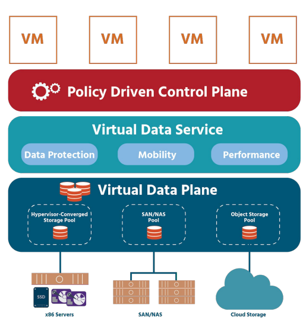

# Week 2: Software Defined Storage Pt.1 (SDS)
---
## **Mục Lục**

### I. [Định nghĩa](#dn)

### II. [Kiến trúc của SDS](#archi)

### III. [Ưu điểm của SDS](#pros)

### IV. [Tài liệu tham khảo](#reference)
---

SDS là 1 concept mới trong nền công nghiệp điện toán và lưu trữ và nó còn liên quan đến rất nhiều công nghệ và công cụ khác. SDS là 1 phần của trào lưu công nghệp lớn bao gồm Software defined network (SDN) và software defined data center (SDDC)
 
### I. Định nghĩa

Software defined storage là hệ thống lưu trữ dòng doanh nghiệp (enterprise class) sử dụng loại phần cứng tiêu chuẩn (standard hardware) với tất cả các chức năng lưu trữ và quản lý quan trọng được thực hiện bởi phần mềm. SDS sẽ cung cấp khả năng tự động hóa, theo quy chuẩn (policy-driven), dịch vụ lưu trữ nhận biết ứng dụng (application-aware: Khả năng của 1 hệ thống để lưu lại và duy trì thông tin về ứng dụng được kết nối để tối ưu hoạt động của nó và tất cả các subsystem nó chạy hoặc điều khiển) thông qua sự điều phối cơ sỏ hạ tằng lưu trữ ở dưới để hỗ trợ môi trường điều khiển mềm

Phần cứng tiêu chuẩn gồm:

- **Disk storage** : Ví dụ như SAN, NAS và disk arrays hoặc JBODs (just a bunch of disks)
- **Network devices** : Ví dụ như switches hoặc network interfaces
- **Servers** : Để xử lý, quản lý và quản trị việc lưu trữ

Các đặc tính thêm của SDS bao gồm:

- Quản trị tự động theo chính sách (Automated policy-driven administration) cho các chức năng quản lý lưu trữ, ví dụ như quản lý vòng đời thông tin (ILM) và cung cấp
- Ảo hóa lưu trữ: Ảo hóa lưu trữ đơn giản là nó thực thi 1 chương trình phần mềm giữa ứng dụng và lưu trữ mà phá vỡ kết nối trực tiếp giữa thiết bị lưu trữ và hệ thống. Với chức năng ảo hóa, ta có thể chuyển dữ liệu từ hệ thống lưu trữ này hoặc phân vùng này sang vị trí khác để tối ưu kinh tế, hiệu năng hoặc bất kỳ giá trị nào khác mà các ứng dụng front end không hề biết và không cần phải thay đổi hay quan tâm gì. Không giống với những model truyền thống khi bất kỳ sự thay đổi nào về vị trí dữ liệu hoặc đặc tính đều đỏi hỏi sự update hay thay đổi của các ứng dụng liên quan
- Phân tách control planes và data planes để quản lý lần lượt cơ sở hạ tầng lưu trữ cà dữ liệu trong cơ sở hạ tầng lưu trữ
- Khả năng scale-out lớn

Nhứng đặc tính này đối lập với hệ thống lưu trữ truyền thống phụ thuộc lớn vào controllers tại phần cứng để thực hiện các chức năng lưu trữ. NAS, DAS và SAN là những ví dụ của những hệ thống lưu trữ nền phần cứng thường thấp mà phụ thuộc vào RAID controllers đặc biệt hoặc phần lõi không tách rời (non-portable firmware) cho các chức năng lưu trữ của nó
Concept SDS bắt đầu nổi lên do sự bùng nổ dữ liệu nhờ sự ra đời của Big Data; việc khó thích nghi với sự thay đổi nhanh của các quy trinh nghiệp vụ (business process) và workloads các ứng dụng liên quan, chi phí sở hữu tắng cao và thách thức về bảo mật của hệ thống lưu trữ truyền thống. 
Các ứng dụng thế hệ mới như phân tích Big Data và cloud-based trở nên phù hợp với các concept của SDS như application-aware storage và application-centric data center. Các hệ thống lưu trữ truyền thống thì không phù hợp với các ứng dụng cloud và big data do sự khác biệt về cấu trúc. Các ứng dụng mới sẽ yêu cầu khả năng mở rộng cao, đảm bảo cả dữ liệu cấu trúc và phi cấu trúc, tập dữ liệu lớn và lưu trữ cả object storage và block storage file.

 
### II. Kiến trúc của SDS
- Virtual Data Plane: Chứa dữ liệu để thực hiện truy hồi và apply data services trước khi chuyển nó đến Policy Driven Control Plane. Nó cũng apply các policy được chọn cho các objects trên datastore.
- Policy-driven Control Plane: Cây cầu nối giữa ứng dụng và cơ sở hạ tầng, đảm bảo rằng các quy định hợp pháp sẽ được đáp ứng trong suốt vòng đời ứng dụng. Ngoài ra, nó còn cung cấp các "danh xưng" cho các vị trí khác nhau trong môi trường IT (application administrator, storage administrator, data protection administrator...). Control Plane được lập trình thông qua Public APIs
- Data services được áp dụng bởi Virtual Data Plane bao gồm:
      - Compression - Nén files
      - Replication - Tạo bản sao dữ liệu để backup
      - Caching - Tạm thời lưu dữ liệu thường sử dụng để truy cập nhanh hơn (quick access)
      - Snapshots - Images của 1 system được lấy để bảo tồn tại 1 thời điểm nhất định
      - Deduplication - Bỏ đi các dữ liệu dự phòng để tạo không gian trống
      - Encryption - Mã hóa dữ liệu để đảm bảo bảo mật
Control planes sẽ quản lý việc cấp phát tài nguyên cho storage services

 

### III. Ưu, nhược điểm của SDS

Các doanh nghiệp ngày nay nhận ra rất nhiều ưu điểm lớn của SDS cho data centers của họ. Chúng bao gồm:

- **Tăng flexibility và Agility** : Các platform truyền thống như SAN và NAS thường dựa trên hệ thống độc quyền với chi phí sở hữu rất cao. Hệ thống SAN thì yêu cầu các SAN switches, storage arrays và các thành phần liên quan khác rất phức tạp và đắt tiền. Thiết bị NAS thì rẻ hơn nhưng lại giới hạn về khả năng mở rộng. Khi hết tài nguyên trên NAS, ta sẽ cần phải add thêm 1 thiết bị NAS khác tuy vậy đây cũng không thực sự là chức năng scale-out khi mỗi thiết bị NAS sẽ được biểu diễn riêng lẻ và quản lý riêng biệt.

Giải pháp SDS sẽ cung cấp thêm sự mềm dẻo bằng cách cho phép các tổ chức sử dụng các loại phần cứng phổ thông, không bị độc quyền. Hơn nữa, các tổ chức có thể nhận được khả năng scale lớn nhờ SDS bằng cách thêm các thành phần phần cứng đơn lẻ cần thiết để tăng dung lượng và hiệu năng

- **Tối ưu tài nguyên thông minh và tự động hóa** : Khả năng tự động hóa, quản lý theo chính sách (policy-driven) của SDS sẽ giúp tối ưu giá cả và lưu trữ.

Ví dụ, SDS sẽ quản lý các chức năng lưu trữ quan trọng như ILM (Information lifecycle management - quản lý vòng đời thông tin), disk caching, snapshots, replication, striping và clustering.

SDN có thể tự động áp dụng các quy luật quản lý dữ liệu và lưu trữ hoặc các chính sách bạn chọn trên toàn tài nguyên lưu trữ. SDS có thể quản lý cả vòng đời của bất kỳ đơn vị dữ liệu nào, di chuyển dữ liệu khi nó còn &quot;nhỏ&quot; và active đến khu vực lưu trữ hiệu năng cao và theo thời gian dữ liệu trở nên ít sử dụng hơn thì lại di chuyển nó đi nơi khác tùy thuộc vào chính sách bạn đặt ra để tối ưu giá cả hoặc hiệu năng hoặc những giá trị khác. Đây được gọi à quản lý vòng đời thông tin (ILM) như đã đề cập ở trên

Ảo hóa lưu trữ sẽ giúp tất cả các hệ thống lưu trữ khác nhau hoạt động như 1 khối thống nhất. Vì thế hiệu năng dex được tối ưu khi dữ liệu có thể linh động di chuyển giữa các khu vực lưu trữ. Ngoài ra ta còn có thể dễ dàng thêm các chức năng và dịch vụ lưu trữ và phân tán ra toàn hệ thống lưu trữ

Nói 1 cách ngắn gọn, các chức năng của software defined storage sẽ giúp bạn đặt đúng dữ liệu vào đúng chỗ, đúng thời điểm, đúng hiệu năng với giá cả hợp lý.

- **Gía cả phải chăng** : Thay vì sử dụng phần cứng độc quyền với giá cao, SDS sử dụng phần cứng tầm trung (standard hardware) để tiết kiệm rất nhiều chi phí và phí sở hữu độc quyền.
- **Không giới hạn mở rộng tài nguyên** : Không giống với các hệ thống lưu trữ như NAS và SAN, SDS sẽ cho phép bạn có thể mở rộng hệ thống lưu trữ với các phần cứng tầm trung, khi vẫn tiếp tục quản lý lưu trữ như 1 hệ thống lưu trữ đơn. Khi mở rộng cơ sở hạ tầng lưu trữ thì hiệu năng và độ tin cậy hệ thống sẽ tiếp tục phát triển theo.
SDS cung cấp khả năng mở rộng lớn, ảo hóa không giới hạn. Ví dụ IBM GPFS hỗ trợ:

  - Kích thước file hệ thống lớn nhất khoảng 1 triệu yottabytes (1 yottabytes bằng 1 nghìn tỷ terabytes)
  - 263 (khoảng 9 nghìn tỷ) files mỗi file system
  - Ipv6
  - 1 đến 16384 nodes trong 1 cluster
- **Hỗ trợ files, blocks và objects storage**

Một số nhược điểm:
- Một số SDS solutions vẫn phần nào phụ thuộc vào thiết bị phần cứng. Một số SDS platforms vẫn yêu cầu phần cứng từ hardware compability lists (HCL) của 1 số vendors nhất định. SDS yêu cầu những hardware này để có thể hỗ trợ cho các chức năng lưu trữ và để chạy cả SDS software stack hoặc ứng dụng lưu trữ.
- Yêu cầu nhiều nhân lực hỗ trợ: Hệ thống phân tán (distributed system) sẽ gặp nhiều thách thức khi vận hành
- Phức tạp: Vận hành phần mềm, triển khai phần cứng phù hợp....
#### IV. Tài liệu tham khảo
- [software-defined-storage-concepts.pdf (netdevgroup.com)]([https://www.ibm.com/cloud/blog/object-vs-file-vs-block-storage](https://www.netdevgroup.com/online/support/courses/documentation/software-defined-storage-concepts.pdf))
- [Software Defined Storage For Dummies, IBM Platform Computing Edition ](https://www.doc-developpement-durable.org/file/Projets-informatiques/cours-&-manuels-informatiques/stockage/SoftwareDefinedStorageforDummies.pdf)
software-defined-storage-concepts.pdf (netdevgroup.com)
- [Software-defined storage: what can it do for you (dellemc.com)](https://education.dellemc.com/content/dam/dell-emc/documents/en-us/2015KS_Gloukhovtsev-Software-defined_StorageWhat_can_it_do_for_you.pdf)
