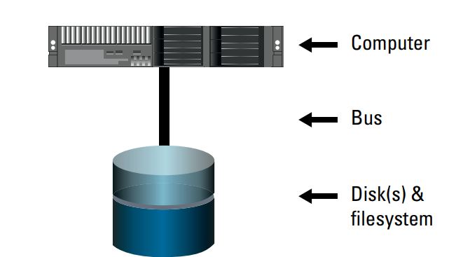
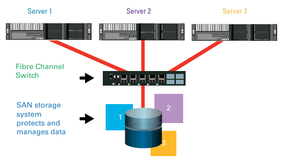
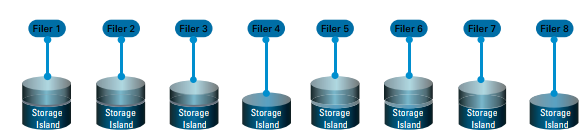
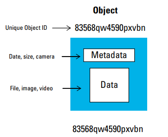
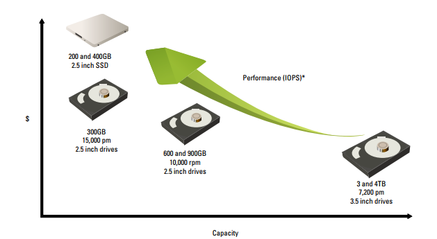

# Week 2: Các thiết bị lưu trữ
---
## **Mục Lục**

### I. [Các hệ thống lưu trữ](#sd)

### II. [Hard disk vs SSD](#ss)

### III. [Tài liệu tham khảo](#reference)

---
 
### I. Các hệ thống lưu trữ**

#### 1. Hệ thống dựa trên cơ chế block storage

**a. Direct-attached storage (DAS)**: DAS là kiểu lưu trữ đơn giản nhất và rẻ nhất cho hệ thống máy tính. Giống như cái tên, DAS kết nối trực tiếp ổ cứng đến máy tính hoặc server thông qua 1 bus interface

**b. Storage Area Network (SAN)**: SAN là hệ thống lưu trữ rời có chức năng tự bảo vệ và quản lý dữ liệu. SAN kết nối đến 1 server hoặc nhiều server qua 1 mạng lưu trữ dành riêng

SAN có thể được sử dụng bởi nhiều servers. Mỗi server sẽ có một hoặc nhiều kết nối nhanh, dành riêng cho lưu trữ (dedicated storage) đến một hoặc nhiều mảng lưu trữ (storage array). SAN cho phép nhiều máy tính có thể chia sẻ truy cập đến các storage controllers. Điều này sẽ cung cấp sự linh hoạt lớn để đảm bảo cơ sở hạ tầng CNTT cho doanh nghiệp. Trong các tổ chức lớn, SAN sẽ cho phép sự chia sẻ công việc khi system administrators có thể quản lý các máy tính còn storage administrators sẽ quản lý SAN

Dữ liệu không thể được chia sẻ giữa các LUNs riêng biệt hoặc volume, kể cả với SAN, trừ khi cluster file system được sử dụng trong SAN. Việc nhiều máy tính chia sẻ truy cập đến cùng 1 dữ liệu rất quan trọng đến nhiều ứng dụng và workflows – khiến cho cluster file system là 1 sự bổ sung cần thiết để sử dụng cho các mục đích chia sẻ.

- `LUN (Logical Unit Number)`: LUN là 1 identifier được cấp cho các đĩa ở hệ thống lưu trữ, nó sẽ được xác định trong storage controller và phân vùng để host servers có thể truy cập vào. 1 máy tính có thể sử dụng các LUNS này để chứa dữ liệu. 1 volume là 1 phần của LUN được tạo ra với volume management software
- `Cluster File System` : Cluster File Systems được sử dụng cho các cluster of computer để file system có thể được chia sẻ và lan truyền qua các hệ thống. 1 cluster file system có thể được truy cập bởi nhiều máy tính vào cùng thời điểm thông qua 1 network hay 1 SAN.

SANs được sử dụng rộng rãi trong các môi trường yêu cầu tốc độ cao hoặc nhiệm vụ chiến lượn, ví dụ Online Transaction Processing (OLTP) Database – Hệ thống quản lý CSDL hoạt động, Enterprise Resource Planning – ERP (Hoạch định tài nguyên doanh nghiệp) và hệ thống ảo hóa

Ưu điểm của SANs bao gồm:

- **Tốc độ cao**: Tốc độ SAN rất cao do:
       - Sử dụng Fabric interconnects (UCS Fabric interconnect là thành phần chính trong hệ thống điện toán hợp nhất của Cisco (Cisco Unified Computing System) – được thiết kế để tăng khả năng mở rộng và giảm chi phí của data centers bằn cách thực thi tất cả các thành phần vào 1 single platform): Tốc độ thường vào khoảng 40 Gbps và 80 Gbps và chuẩn InfiniBand EDR trong 1 cluster 12x có thể lên đến 300 Gbps tốc độ dữ liệu.
       - Thêm tốc độ: Việc bạn thêm nhiều drives vào 1 SAN giúp bạn tăng tốc độ truy cập đọc ghi khả dụng cho máy tính sử dụng SAN
       - Tối ưu quản lý: Quản lý xử lý và lưu trữ tách rời nhau
       - Bảo vệ dữ liệu: Chức năng bảo vệ dữ liệu, ví dụ như back-up và tạo bản sao off-site, có thể được làm bên ngoài máy tình chạy ứng dụng và không ảnh hưởng đến hiệu ặng của servers

So sánh với các hệ thống lưu trữ khác thì SANs sẽ có giá thành cao hơn vì nó đươc thiết kế để cho ra hiệu năng và độ tin cậy cao nhất

#### 2. Hệ thống dựa trên cơ chế file storage

Hệ thống dựa trên cơ chế file storage như thiết bị NAS sẽ lưu trữ dữ liệu trên ổ cứng như files trong cấu trúc direcotry. Các thiết bị này sẽ tự có bộ xử lý và HĐH và được truy cập sử dụng một giao thức chuẩn qua mạng TCP/IP. Các giao thức đó là

- **SMB (Server Message Block) hoặc CIFS (Common Internet File System):** SMB hoặc CIFS được sử dụng nhiều trong hệ thống mạng nền Windows
- **NFS (Network File System):** NFS rất phổ biến trong các hệ thống mạng nền Unix và Linux
- **HTTP (Hypertext Transfer Protocol):** HTTP là giao thức thường được dùng khi sử dụng trình duyệt web

Các thiết bị NAS rất dễ để triển khai client truy cập cũng rất rõ ràng sử dụng giao thức. Các máy tính và thiết bị NAS đều được kết nối thông qua mạng TCP/IP được chia sẻ và dữ liệu lưu trữ trên thiết bị NAS có thể được truy cập ảo bởi bất kỳ máy tính nào, không ràng buộc HĐH

Các thiết bị NAS rất phổ biến trong datacenter ngày nay. Tuy vậy, thiết bị NAS cũng có rất nhiều khuyết điểm lớn. Nó chậm hơn so với DAS hoặc SAN và hiệu năng lưu trữ có thể đến ngưỡng thắt cổ chai bởi vì tất cả dữ liệu sẽ phải đi qua bộ xử lý riêng của NAS. Thiết bị NAS cũng bị giới hạn khả năng mở rộng. Khi 1 thiết bị NAS đầy, bạn sẽ phải tiếp tục thêm vào, thêm vào thiết bị để đáp ứng nhu cầu. Nó sẽ tạo ra &quot;islands of storage&quot; và gây khó khăn cho việc lưu trữ

#### 3. Hệ thống dựa trên cơ chế object storage

Hệ thống nền object sử dụng các containers để chứa dữ liệu trong 1 không gian địa chỉ phẳng (flat address space). 1 cointainer sẽ lưu trữ dữ liệu thực, metadata và Object ID riêng biệt để xác định objects. Dữ liệu trong hệ thống lưu trữ nền object sẽ được truy cập sử dụng HTTP qua web browser hoặc trực tiếp qua API REST. Flat address space sẽ cho phép việc đơn giản hóa và mở rộng lớn trong lưu trữ nhưng dữ liệu trong các hệ thống này lại không thể sửa đổi (ngoài việc xóa bỏ hay ghi đè version mới)
- Container là 1 bundle nhỏ, gọn của 1 hoặc nhiều ứng dụng và các thành phần phụ thuộc cần thiết để code đó có thể chạy hay nói cách khác, 1 container có code, runtime environment, system tools và libraries. 1 container cũng có thể chứa các dịch vụ cơ sở hạ tầng như storafe, hay 1 hybrid của các apps và storagr. Đóng gói tất cả mọi thứ cùng nhau khiến 1 container trở nên gọn và tiện và sẽ giúp giảm các xung đột thực thi.
 - Containers thường được so sánh với máy ảo (VMs) nhưng kích thước của VM thì nhỏ hơn rất nhiều. 1 container chỉ cần 1 phần nhỏ của hệ điều hành và tài nguyên hệ thống để có thể chạy các nội dung của nó, mà có thể là 1 hay nhiều ứng dụng. Và container còn có thể chạy ở bất cứ đâu
 - Flat address space – Hệ thống bộ nhợ gán địa chỉ máy tính. Address space là bộ nhớ được cấp cho tất cả địa chỉ có thể cho 1 thực thể điện toán, ví dụ như 1 thiết bị, 1 file hay 1 server.

Hệ thống lưu trữ nền storage sẽ thường được sử dụng cho cloud services của các nhà cung cấp như IBM, Amazon S3, Google và Facebook

 
### II. Hard Disk và SSD

Các ổ cứng được sử dụng phổ biến hiện nay bao gồm SATA (Serial ATA), SAS (Serial Attached SCSI) và SSD (Solid State Drives). Mỗi loại sẽ cung cấp dung lượng, hiệu năng và có giá cả khác nhau

#### 1. Hard disk

SATA drives sẽ cung cấp được dung lượng lớn nhất (2 đến 4 TB) và tỷ lệ giá/gigabytes cũng rẻ nhất. Tuy vậy SATA drives sẽ chậm hơn (thường là 7200 RPM) và thiếu tin cậy hơn các công nghệ khác. SATA thường được thực thi trong SANs như là ổ lưu trữ thứ hai và cho các dữ liệu ứng dụng với yêu cầu thấp về IOPS

> Mỗi công nghệ lưu trữ sẽ là 1 sự đánh đổi giữa dung lượng, hiệu năng và giá cả

SAS drives thường được sử dụng trong servers (DAS) hoặc SANs. SAS drives sẽ cung cấp 1 sự đánh đổi giữa hiệu năng và dung lượng. Khi hiệu năng của nó rất cao (10000 đến 15000 RPM) trong khi dung lượng thấp (300, 600 đến 900 GB). SAS drives đáng tin cậy hơn SATA drives và các thành phần của nó được thiết kế để xứ lý nhiều tác vụ đọc/viết và yêu cầu IOPS cao

#### 2. SSD

SSD sử dụng công nghệ flash để cung cấp việc lưu trữ dữ liệu tốc độ cao và tin cậy. Flash storage sử dụng transistors cổng trôi (floating gate transistors) để lưu trữ dữ liệu thành 0s và 1s trong các cell đơn. Dung lượng SSD tăng rất nhanh, với dung lượng hiện tại lên đến khoảng 500GB, và cực kỳ nhanh: Tác vụ đọc/viết trong Flash storage được đo theo microseconds so với milliseconds của HDD, và IOPS được đo trong khoảng từ 10000 đến 1 triệu, so sánh với hàng trăm của HDD. Mặc dù giá của SDD đang giảm xuống và dung lượng tăng lên, công nghệ SSD vẫn là cấp cao nhất và được sử dụng nhiều trong trường hợp hiệu năng cao cần thiết hơn dung lượng.
