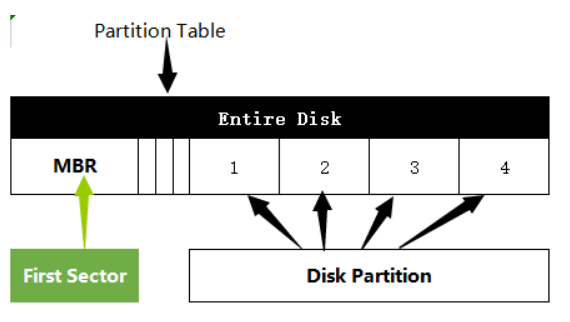
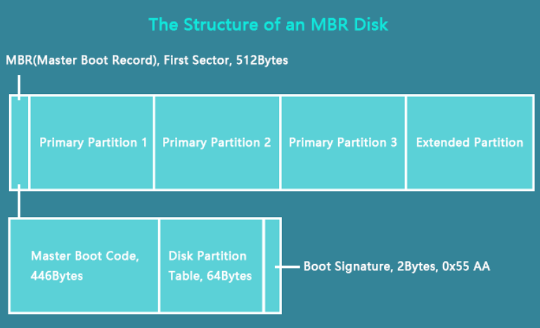
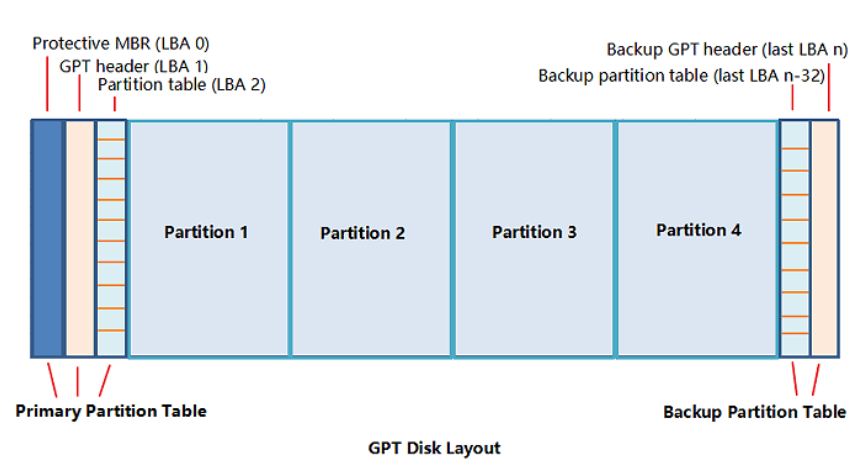
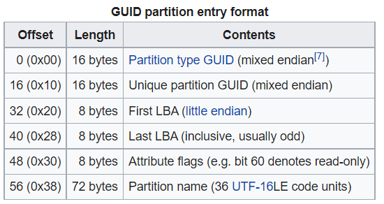
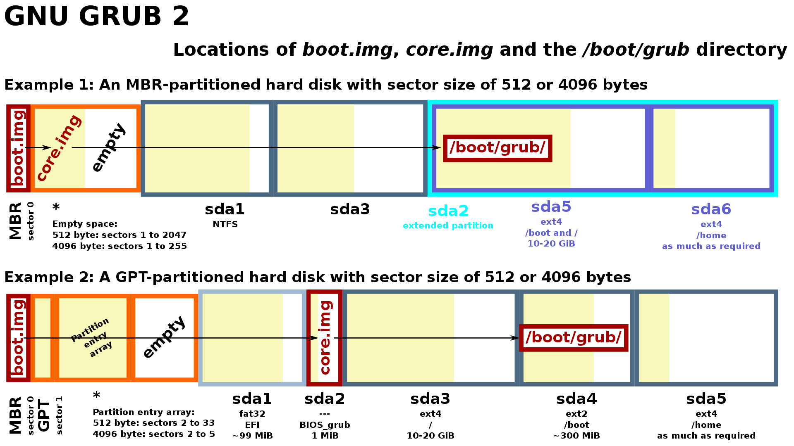

# Week 3: Partition
----        
## Mục Lục 
[I. Partition Table](#pt)
- [1. MBR](#mbr)
- [2. GPT](#gpt)
- [3. Sự khác nhau giữa MBR và GPT](#diff)           

[II. GRUB Bootloader](#grub)   
- [1. GRUB là gì?](#meaning)  
- [2. Các tính năng của GRUB](#feature)  
- [3. Cách thức hoạt động](#active)  

[III. References](#references)

---- 
 
## I. Partition Table

Partition Table là 1 bảng trên ổ cứng, được duy trì bởi HĐH và có chức năng outline và mô tả về các phân vùng trên ổ cứng cho HĐH biết. Các thông tin phân vùng của 1 ổ cứng sẽ được lưu trữ trong partition table, thông tin này bao gồm phân vùng bắt đầu và kết thúc ở đâu trên ổ cứng vật lý, nên hệ điều hành sẽ biết sectors nào thuộc về phân vùng nào, và phân vùng nào sẽ có thể boot. Các loại partition table được sử dụng phổ biến hiện nay là MBR và GPT.

 
### 1. MBR (Master Boot Record)

MBR (Master Boot Record) là phần code nhỏ chịu trách nhiệm load hệ điều hành trên máy tính. MBR còn chứa các thông tin phân vùng và cách mà các phân vùng được phân bố. Master boot record code sẽ được lưu trữ trong sector đầu tiên trên ổ cứng (sector 0) - sector này sẽ không thuộc phân vùng nào

Khi PC được bật, MBR sẽ bắt đầu chạy chương trình BIOS lưu trữ rên ROM hay nói cách khác khi bật máy, code MBR sẽ được đọc đầu tiên để load HĐH từ ổ cứng

- MBR Structure: MBR gồm 3 phần chính:
      - **Master boot routines**: 446 bytes và chứa 1 biến load coder, thông tin cần thiết của MBR. Một khi hard disk được boot, MBR cấp quyền điều khiển cho OS trong partition table
      - **Disk Partition**: Chứa thông tin phân vùng và vị trí của chúng, 64 bytes
      - **Boot signature**: Hay identifier code, dùng để xác định xem MBR code có đúng hay không. Nếu không thì máy tính sẽ không thể boot

 
### 2. GPT (GUID Partition table)
GPT được định nghĩa là 1 kiểu partition table cho ổ cứng vật lý. GPT disk bao gồm Primary Partitiom Table, Data Partitions và Backup Partition Table. Nó được gọi là  GUID Partition Table vì tất cả phân vùng trên ổ cứng có 1 “globally unique identifier”

Cấu trúc của GPT gồm:
- **Primary Partition Table**: Bao gồm protective MBR, GPT header và partition table để giúp hệ điều hành load thông tin và truy cập dữ liệu phân vùng hiện có
           - `Protective MBR`: Đảm bảo rằng các công cụ cũ (chỉ có thể đọc được MBR) sẽ không nhầm lẫn GPT drive với 1 drive không được phân vùng và ghi lại dữ liệu của GPT đó theo 1 MBR mới
           - `GPT Header`: Xác định vị trí và và kích thước của các partition entries bao gồm partition table và CRC checksum được sử dụng để xác định sự toàn vẹn của GPT Header. Khi CRC phát hiện dữ liệu bị lỗi, nó sẽ tìm cách khôi phục dữ liệu bằng cách sử dụng bản backup
           - `Partition table (Partition entries array)`: Mảng chứa các partition entries, mỗi parition entries ứng với mỗi phân vùng được tạo. Format của Partition entries
           

- **Normal Data Partitions**: Nơi dữ liệu được lưu trữ
- **Backup Partition Table**: Nơi ổ GPT giữ thông tin back up cho GPT header và partition table

 
### 3. Sự khác nhau giữa MBR và GPT
Sự khác biệt giữa MBR và GPT:

- MBR ra đời sớm hơn GPT mới ra đời 1 vài năm trước. MBR được sử dụng với các máy tính sử dụng BIOS cũ (Legacy BIOS) , GPT là công nghệ phân vùng mới và là được dùng cho các máy tính sử dụng UEFI (Unified Extensible Firmware Interface) BIOS

| Boot Process | Legacy BIOS | UEFI         |                                                                                                          
|--------------|-------------|--------------|
| 1 | Bật nguồn | Bật nguồn| 
| 2 | Tự kiểm tra (POTS)| Boot manager của UEFI kiểm tra cấu hình boot                    | 
| 3 | Loads BIOS       | Boot manager load vào bộ nhớ và thực thi OS loader hoặc OS kernel                       |
| 4 | Nhận diện thiết bị boot  |               |
| 5 | BIOS tìm code lưu trữ trong MBR  ||
| 6 | MBR loads code từ Boot Sector |               |
| 7 | Bootsector loads và chạy Boodloader  |                  |

- MBR hỗ trợ cho từ Windows 7 trở xuống còn GPT hỗ trợ các HĐH mới như Windows 8, 10, 11
- MBR sử dụng 32 bits cho 1 block logic, còn GPT cấp 64 bits chi 1 block logic. Từ đó dung lượng tối đa của MBR là khoảng 2.2 TB còn GPT là 9.4 ZB (1 ZB = 1 tỷ TB)
- MBR chỉ hỗ 3 phân vùng chính, 1 phân vùng phụ với kích thước phân vùng lớn nhất là 2TB. Với GPT thì HĐH Windows cho phép nhiều nhất 128 phân vùng trên 1 GPT drive và không giới hạn với các HĐH khác, với kích thước phân vùng lớn nhất là 256 TB. 
- GPT chứa các giá trị backup của GPT Header và Entries trong 1 phân vùng riêng nên GPT có khả năng khôi phục hơn MBR
- GPT cũng lưu trữ các giá trị CRC (Cyclic redundancy check – Cơ chế phát hiện lỗi được sử dụng nhiều trong thiết bị lưu trữ) để kiểm tra tính nguyên vẹn của dữ liệu. Nếu dữ liệu bi lỗi thì, GPT sẽ nhận ra vấn đề và sẽ cố khôi phục dữ liệu từ 1 vị trí khác trong ổ đĩa. MBR thì sẽ không biết dữ liệu của nó bị lỗi ở đâu và ta chỉ có thể phát hiện lỗi khi quá trình boot failed hoạc phân vùng drive bị mất

 
## II. GRUB Bootloader

 
### 1. GRUB là gì?

GNU GRUB (GRand Unified Bootloader) là một chương trình khởi động máy tính (boot loader) được phát triển bởi dự án GNU. GRUB hỗ trợ nhiều hệ điều hành trên cùng  1 máy tính và nó sẽ chịu trách nhiệm phát hiện và cung cấp cho người dùng lựa chọn cho phép khởi động một trong những hệ điều hành đã được cài trên máy. 

GNU GRUB được phát triển từ gói phần mềm GRUB (Grand Unified Bootloader) và được sử dụng chủ yếu cho các hệ thống tương tự Unix, Linux và Solaris

Qúa trình GRUB được tiến hành sau khi OS đọc partition table

Có hai phiên bản của GRUB đang được sử dụng phổ biến:
- GRUB 1 hay còn được gọi là GRUB legacy, chỉ còn được sử dụng ở các phiên bản cũ của các bản phân phối Linux. GRUB 2, được viết lại từ đầu với mục tiêu thay thế phiên bản tiền nhiệm GRUB 1 và được sử dụng bởi đa số các bản phân phối Linux hiện nay.
- GRUB có 2 cơ chế boot riêng biệt. 1 là load 1 hệ điều hành trực tiếp (dành cho các HĐH hỗ trợ Multiboot như Linux, FreeBSD, NetBSD và OpenBSD). 2 là chain-load(tải chuỗi) 1 HĐH bằng cách load 1 boot loader khác và bood loader đó sẽ load HĐH mà chúng ta cần (Dành cho các HĐH không hỗ trợ Multiboot như Windows)

 
### 2. Các tính năng của GRUB:
- Hỗ trợ nhiều hệ điều hành 
- Hỗ trợ nhiều hệ thống tập tin: BSD FFS, DOS FAT16 và FAT32, Minix fs, Linux ext2fs và ext3fs, ReiserFS, JSF, XFS, và VSTa fs.
- GRUB có thể được tải và chạy từ bất kỳ thiết bị nào, bao gồm ổ cứng và floppy disks, DVDs, CD-ROMs và USB drives
- Nó có thể giải nén hệ điều hành trước khi thực thi
- Nó có thể load hệ điều hành từ nhiều vị trí
- Cung cấp giao diện dòng lệnh linh hoạt, dễ tương tác
- Phát hiện tất cả RAM được cài trên máy

 

### 3. Cách thức hoạt động:
Với các hệ thống thuần BIOS cũ (BIOS Legacy): boot.img sẽ được ghi trong Master Bood Code. Boot.img sẽ trỏ đến diskboot.img. Diskboot.img là sector đầu tiên của core.img với mục địch chính là load phần còn lại của core.img và được nhận diện vởi số LBA sectors được ghi bởi grub-install. Trong ổ cứng phân vùng MBR, core.img sẽ được lưu trữ trong sector đầu tiên của phân vùng đầu với MBR. Còn với ổ cứng phân vùng GPT thì core.img sẽ được ghi trong 1 phân vùng riêng của nó và đặt flag là “BIOS\_grub”.
core.img sẽ load /boot/grub/i386-pc/normal.mod từ phân vùng được ghi lại bởi grub-install. Nếu số phân vùng thay đổi thi GRUB sẽ không thể tiến vào normal.mod và nó sẽ đưa người dùng vào chế độ GRUB Rescue prompt. Còn nếu phân vùng đúng và nó vào được normal.mod thì normal.mod sẽ giải mã (parse) file /boot/grub/grub.cfg, load modules và đưa ta vào menu GRUB

Với cá hệ thống UEFI thì /efi/<distro>/grubx64.ef sẽ được tải như 1 file trong  EFI System Partition và được boot trực tiếp bởi firmware mà không cần boot.img như MBR sector 0. Boot/grub sẽ được lưu trong EFI System Partition hoặc phân vùng boot/partition riêng biệt. Sau đó file file /boot/grub/x86\_64-efi/normal.mod sẽ được load và đưa ta vào menu GRUB

   
### III. Reference

- [What Is GPT and How to Set Up GPT Disk in Windows \[Everything You Need to Know\] - EaseUS](https://www.easeus.com/diskmanager/what-is-gpt.html)

- [What is the Master Boot Record (MBR)? (techtarget.com)](https://www.techtarget.com/whatis/definition/Master-Boot-Record-MBR)

- [What’s the Difference Between GPT and MBR When Partitioning a Drive? (howtogeek.com)](https://www.howtogeek.com/193669/whats-the-difference-between-gpt-and-mbr-when-partitioning-a-drive/)

- [An Ultimate Guide to the Master Boot Record (MBR) - EaseUS](https://www.easeus.com/diskmanager/master-boot-record.html)

- [GPT vs MBR Disks - Windows Enterprise Desktop (techtarget.com)](https://www.techtarget.com/searchenterprisedesktop/blog/Windows-Enterprise-Desktop/GPT-vs-MBR-Disks)

- [Disk partitioning - Wikipedia](https://en.wikipedia.org/wiki/Disk_partitioning#:~:text=A%20partition%20table%20is%20a,terms%20and%20can%20used%20interchangeably.)

- [MBR VS GPT | What's the Difference and Which Is Better - EaseUS](https://www.easeus.com/partition-master/mbr-vs-gpt.html#part2)

- [Type | Microsoft Docs](https://docs.microsoft.com/en-us/windows-hardware/customize/desktop/unattend/microsoft-windows-setup-diskconfiguration-disk-createpartitions-createpartition-type)

- [GNU GRUB - Wikipedia](https://en.wikipedia.org/wiki/GNU_GRUB)

- [What is GNU GRUB? - Definition from WhatIs.com (techtarget.com)](https://www.techtarget.com/whatis/definition/GNU-GRUB)

- [GNU GRUB Manual 2.06](https://www.gnu.org/software/grub/manual/grub/grub.html#Features)

